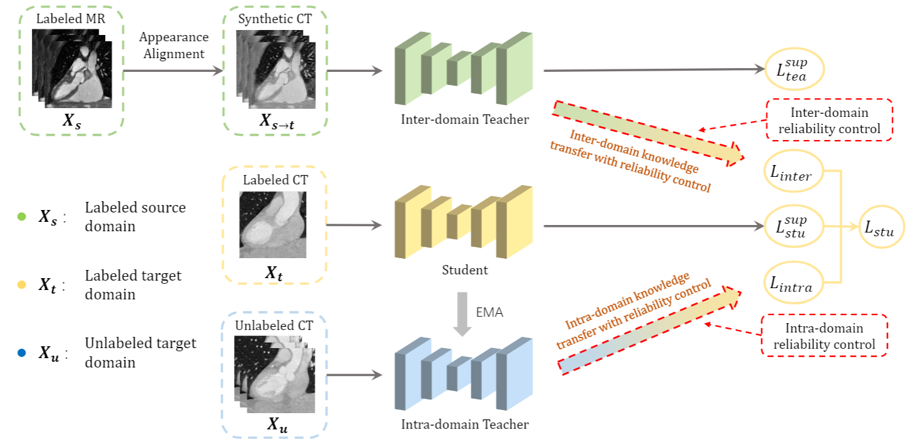

# Dual-Teacher++: Exploiting Intra-domain and Inter-domain Knowledge with Reliable Transfer for Cardiac Segmentation.

by Kang Li, [Shujun Wang](https://www.cse.cuhk.edu.hk/~sjwang), [Lequan Yu](https://yulequan.github.io/) and [Pheng-Ann Heng](http://www.cse.cuhk.edu.hk/~pheng/).

## Introduction
This repository is the Pytorch implementation of Dual-Teacher++, accepted by the Special Issue on Annotation-Efficient Deep Learning for Medical Imaging in IEEE Transactions on Medical Imaging.

The conference version of our work for MICCAI 2020, i.e., [Dual-Teacher](https://link.springer.com/chapter/10.1007/978-3-030-59710-8_41), is in another repository.

<br/>
<p align="center">
  
</p>

Our paper and code will be release soon.


## Citation
If this respository is useful for your research, please consider citing:
```angular2html
@inproceedings{li2020Dual,
  title={Dual-Teacher: Integrating Intra-domain and Inter-domain Knowledge for Annotation-efficient Cardiac Segmentation.},
  author={Kang Li, Shujun Wang, Lequan Yu and Pheng-Ann Heng},
  booktitle={MICCAI}, 
  year={2020}
}
```


## Acknowledgement
Part of the code is revised from the [Pytorch implementation of CycleGAN](https://github.com/junyanz/pytorch-CycleGAN-and-pix2pix).

## Note
* Please feel free to drop me an email for any question.
* Contact: Kang Li (kli@cse.cuhk.edu.hk)
